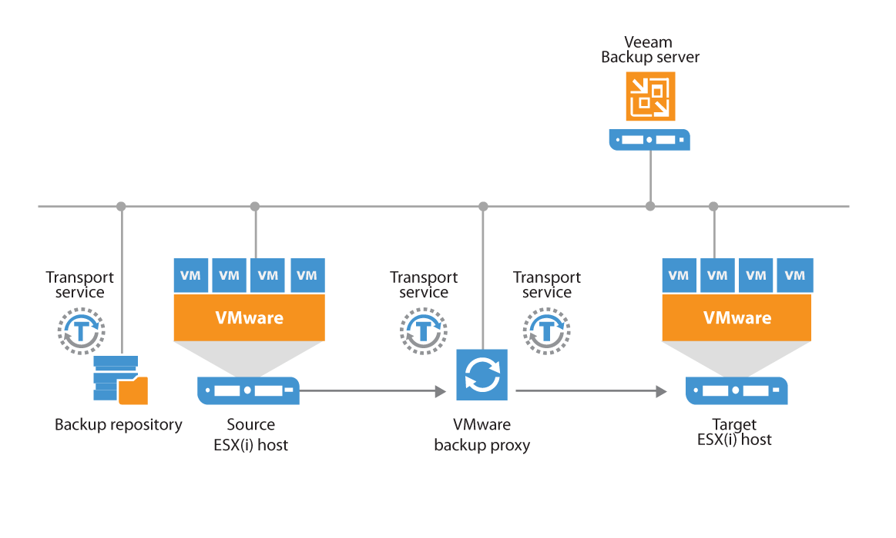
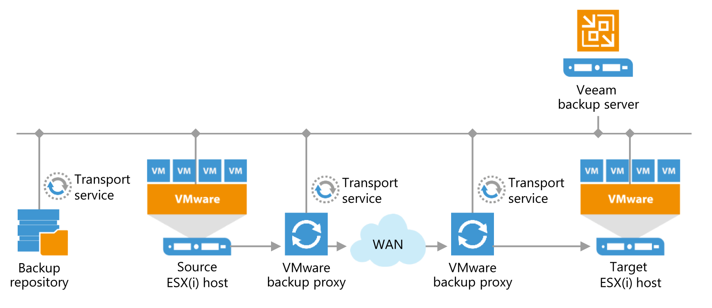
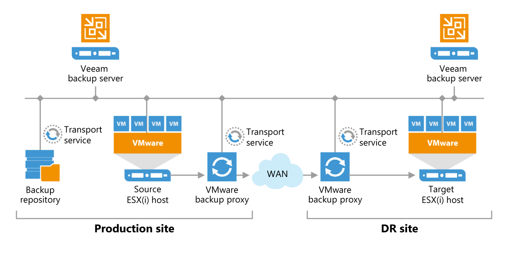
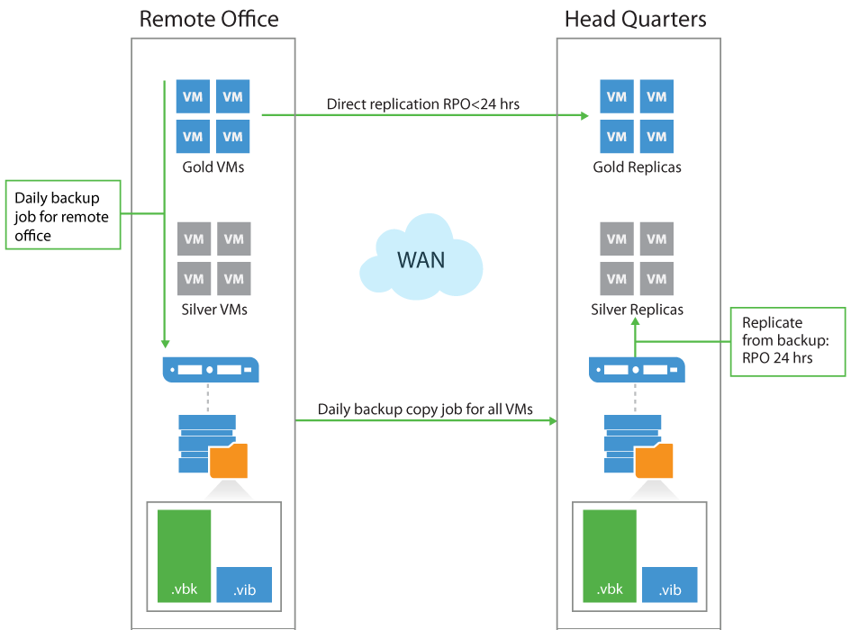

# Replication Job

Replication jobs are used to replicate specified VMs to another or the
same virtual environment (instead of creating deduplicated and
compressed backup files at backup run). Veeam can store 28 restore
points (VMware).

Like backup, replication is a job-driven process. In many ways, it works
similarly to forward incremental backup:

-   During the first run of a replication job, Veeam Backup &
    Replication copies a whole VM image and registers the replicated VM
    on the target ESXi host.

-   During subsequent runs, the replication job copies only incremental
    changes, and creates restore points for the VM replica — so the VM
    can be recovered to the necessary state. Every restore point is in
    fact a usual VMware snapshot.

-   When you perform incremental replication, data blocks that have
    changed since the last replication cycle are written to the snapshot
    delta file next to the full VM replica. The number of restore points
    in the chain depends on the retention policy settings.

Replication infrastructure and process are very similar to those used
for backup. They include a source host, a target host with associated
datastores, one or two proxy servers and a repository. The source host
and the target host are the two terminal points between which the
replicated data is moved.

Replicated data is collected, transformed and transferred with the help
of Veeam data movers. The data movers involved in replication work with
the source proxy, the target proxy and the repository. The data mover
hosted on the repository processes replica metadata files.

**Important!** Although the replica data is written to the target
datastore, certain replica metadata must be located on a backup
repository. This metadata is used by the source proxy and thus should be
deployed closer to the source host and therefore no
compression/uncompression processing is used.

The replication process involves the following steps: 

1.  When a new replication session is started, the source-side data
    mover (proxy task) performs the same operations as in
    backup process. In addition, in cases when VMware CBT mechanism
    cannot be used, the source-side data mover interacts with the
    repository data mover to obtain replica metadata — in order to
    detect which blocks have changed since the previous job run. 

2.  The source-side data mover compresses the copied blocks of data and
    transfers them to the target data mover.

**Note**: In on-site replication scenarios, the source-side transport
service and the target-side transport service may run on the same backup
proxy.

3.  The target-side data mover uncompresses replica data and writes it
    to the destination datastore.

Veeam Backup & Replication supports a number of replication scenarios
that depend on the location of the target host and will be discussed
later in this section.

During replication cycles, Veeam Backup & Replication creates the
following files for a VM replica:

-   A full VM replica (a set of VM configuration files and
    virtual disks).

During the first replication cycle, Veeam Backup & Replication copies
these files to the selected datastore to the *&lt;ReplicaName&gt;*
folder, and registers a VM replica on the target host.

-   Replica restore points (snapshot delta files).
    During incremental runs, the replication job creates a snapshot
    delta file in the same folder, next to a full VM replica.  

-   Replica metadata where replica checksums are stored.
    Veeam Backup & Replication uses this file to quickly detect changed
    blocks of data between two replica states. Metadata files are stored
    on the backup repository.

During the first run of a replication job, Veeam Backup & Replication
creates a replica with empty virtual disks on the target datastore.
Disks are then populated with data copied from the source side.

To streamline the replication process, you can deploy the backup proxy
on a virtual machine. The virtual backup proxy must be registered on an
ESXi host with direct connection to the target datastore. In this case,
the backup proxy will be able to use the Virtual Appliance (hotadd) transport
mode for writing replica data to target. In case of NFS datastore at target,
you can as well use Direct Storage access mode (Direct NFS) to write the data.

If the [Virtual
Appliance](https://helpcenter.veeam.com/backup/vsphere/virtual_appliance.html)
mode is applicable, replica virtual disks are mounted to the backup
proxy and populated through the ESX I/O stack. This results in increased
writing speed and fail-safe replication to ESXi targets. For information
on Virtual Appliance mode, see
<https://helpcenter.veeam.com/backup/vsphere/virtual_appliance.html>. 

If the backup proxy is deployed on a physical server, or the Virtual
Appliance or Direct NFS mode cannot be used for other reasons,
Veeam Backup & Replication will use the
[Network](https://helpcenter.veeam.com/backup/vsphere/network_mode.html)
transport mode to populate replica disk files. For information on the
Network mode, see
<https://helpcenter.veeam.com/backup/vsphere/network_mode.html>.

The Direct SAN mode (as part of Direct Storage Access) can only be used
together with replication targets in case of transferring thick-provisioned
VM disks at the first replication run. As replication restore points are
based on VMware snapshots, that are thin provisioned by definition, Veeam
will failback to Virtual Appliance (HotAdd) mode or Network mode, if configured at
proxy transport settings. Direct SAN mode or backup from storage
snapshots can be used on the source side in any scenario.

### Onsite Replication

If the source and target hosts are located in the same site, you can use
one backup proxy for data processing and a backup repository for storing
replica metadata. The backup proxy must have access to both source host
and target host. In this scenario, the source-side data mover and the
target-side data mover will be started on the same backup proxy.
Replication data will be transferred between these two data movers and
will not be compressed.

 

### Offsite Replication

The common requirement for offsite replication is that one Veeam data
mover runs in the production site (closer to the source host), and
another data mover runs in a remote DR site (closer to the target host).
During backup, the data movers maintain a stable connection, which
allows for uninterrupted operation over WAN or slow links.

Thus, to replicate across remote sites, deploy at least one local backup
proxy in each site:

1.  A source backup proxy in the production site.

2.  A target backup proxy in the remote DR site.  

The backup repository must be deployed in the production site, closer to
the source backup proxy.

 

**Tip**: It is recommended to place a Veeam backup server on the replica
target side so that it can perform a failover when the source side is
down.
When planning off-site replication, consider advanced possibilities —
replica seeding, replica mapping and WAN acceleration. These mechanisms
reduce the amount of replication traffic while network mapping and re-IP
streamline replica configuration.

For offsite replication, open the connections between the Veeam backup
components:

-   The Veeam backup server must have access to the vCenter Server, the
    ESXi hosts, the source backup proxy and the target backup proxy.

-   The source backup proxy must have access to the Veeam backup server,
    the source ESXi host, backup repository holding the replica
    metadata, the target proxy, and the source vCenter Server.

-   The target backup proxy must have access to the Veeam backup server,
    the source proxy, the target ESXi host, and the target
    vCenter Server.

The source proxy compresses data and sends it via the WAN to the target
proxy, where the data is uncompressed. Note that you also can seed the
replica by sending the backup files offsite (using some external media,
for example) and then only synchronize it with incremental job runs.

In this scenario:

-   The Veeam backup server in the production site will be responsible
    for backup jobs (and/or local replication).

-   The Veeam backup server in the DR site will control replication from
    the production site to the DR site.

Thus, in disaster situation, all recovery operations (failover, failback
and other) will be performed by the Veeam backup server in the DR site.
Additionally, it may be worth installing the Veeam Backup Enterprise
Manager to have visibility across the two Veeam backup servers so that
you only have to license the source virtual environment once (used from
both backup servers)

**Tip:** Plan for possible failover carefully. DNS and possibly
authentication services (Active Directory, for example) should be
implemented redundant across both sides. vCenter Server (and vCD)
infrastructure should be as well considered for the failover scenario.
In most cases, Veeam do not need a vCenter Server for replica target
processing. It can be best practice to add the ESXi hosts from the replica
target side (only) directly to Veeam Backup & Replication as managed
servers and to perform replication without vCenter Server on the target side.
In this scenario a failover an be performed from the Veeam console without
an working vCenter Server itself (for example to failover the vCenter Server).

Replication bandwidth estimation has always been a challenge, because it
depends on multiple factors such as the number and size of VMs, change
rate (at least daily, per RPO cycle is ideal), RPO target, replication
window. Full information about these factors, however, is rarely at
hand. You may try to set up a backup job having the same settings as the
replication job, and test the bandwidth (as the backup job will transfer
the same amount of data as the replication job).

Also, when replicating VMs to a remote DR site, you can manage network
traffic by applying traffic throttling rules or limiting the number of
data transfer connections. See Veeam Backup & Replication User Guide for
more information:
<https://helpcenter.veeam.com/backup/vsphere/setting_network_traffic_throttling.html>.

**Tip:** Replication can leverage WAN
acceleration allowing a more effective use of the link between the
source and remote sites. For more information, see the User Guide
<https://helpcenter.veeam.com/backup/vsphere/wan_acceleration.html>
or the present document (the “WAN Acceleration“ section above).

### Replication from Backups

When using replication from backup, the target VM updates
directly from the backup files created by a backup or backup copy job.

In some circumstances, you can get a better RTO with an RPO greater or
equal to 24 hours, using replicas from backup. A common example beside
the usage of proactive VM restores, is a remote office infrastructure,
where the link between the remote site and the headquarters provides
limited capacity.

In this case, the data communication link should be mostly used for the
critical VM replicas synchronization with good RPO. Now, assuming that a
backup copy job runs for all VMs every night, some non-critical VMs can
be replicated from the daily backup file. This requires only one VM
snapshot and only one data transfer.

You can find additional information about replica from backup in the
appropriate section of the Veeam Backup & Replication User Guide:
<https://helpcenter.veeam.com/backup/vsphere/replica_from_backup.html>

**Tip:** This feature is sometimes named and used as proactive restore.
Together with SureReplica, it is a powerful feature for availability.

### Backup from Replica

It may appear an effective solution to create a VM backup from its
offsite replica (for example, as a way to offload a production
infrastructure); however this scheme is not at all valid because of
VMware limitations concerning CBT (you cannot use CBT if the VM was
never started). There is a very well documented forum thread about this
subject:
<http://forums.veeam.com/vmware-vsphere-f24/backup-the-replicated-vms-t3703-90.html>.
